# Catalogo de Videojuegos

En este archivo presentare de forma breve de que se trata el proyecto aqui construido, tecnologias utilizadas y las instrucciones necesarias para correr el proyecto en cualquier otra maquina.

### Descripcion del proyecto
El proyecto se trata sobre una aplicación web que tiene como objetivo principal gestionar un catalogo de videojuegos para los usuarios que decidan registrarse en la aplicacion. La aplicación consta principalmente de las siguientes secciones:
- **Landing:** Esta es la pagina principal de la aplicacion web, en donde se presenta el objetivo de la aplicacion web y se presenta al usuario botones para registrarse o iniciar sesion.
  
  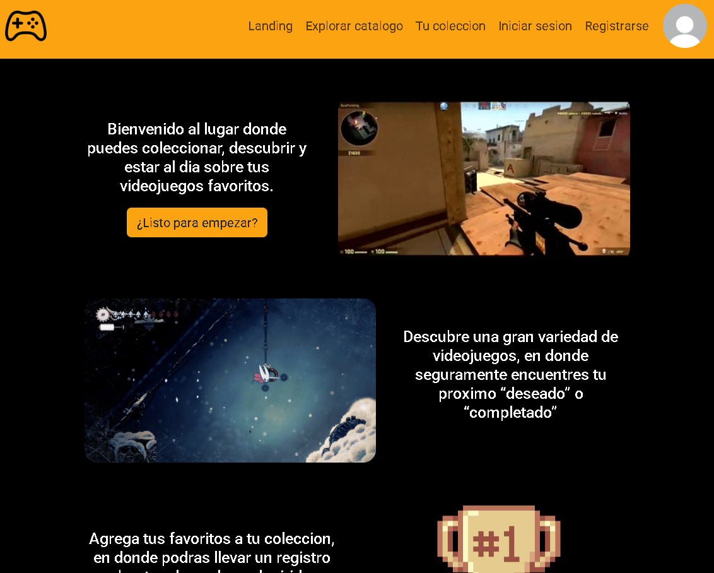 

- **Inicio de sesión:** Formulario donde el usuario podra iniciar sesión.
  
  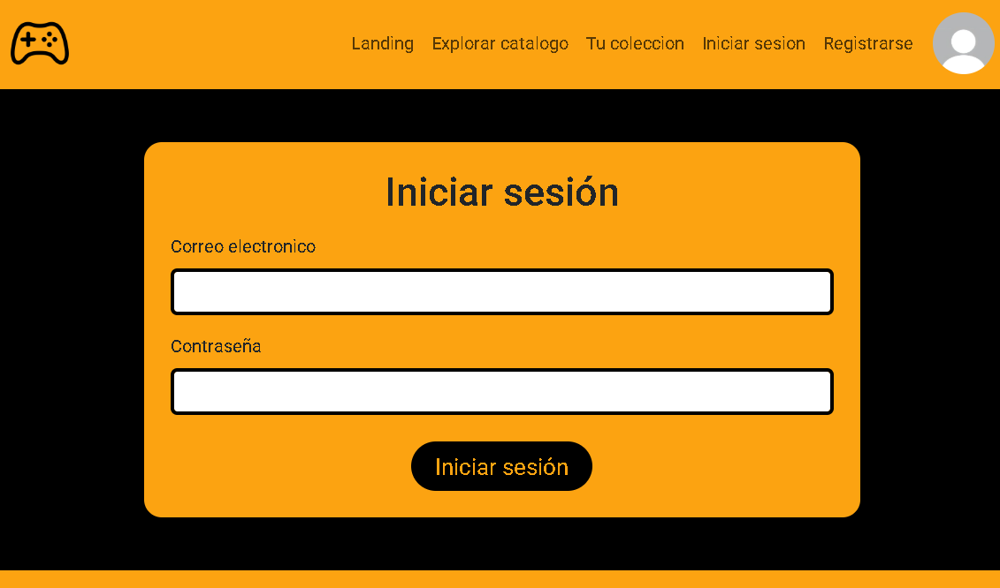

- **Registro:** Formulario donde el usuario podra crear una cuenta. 
  
  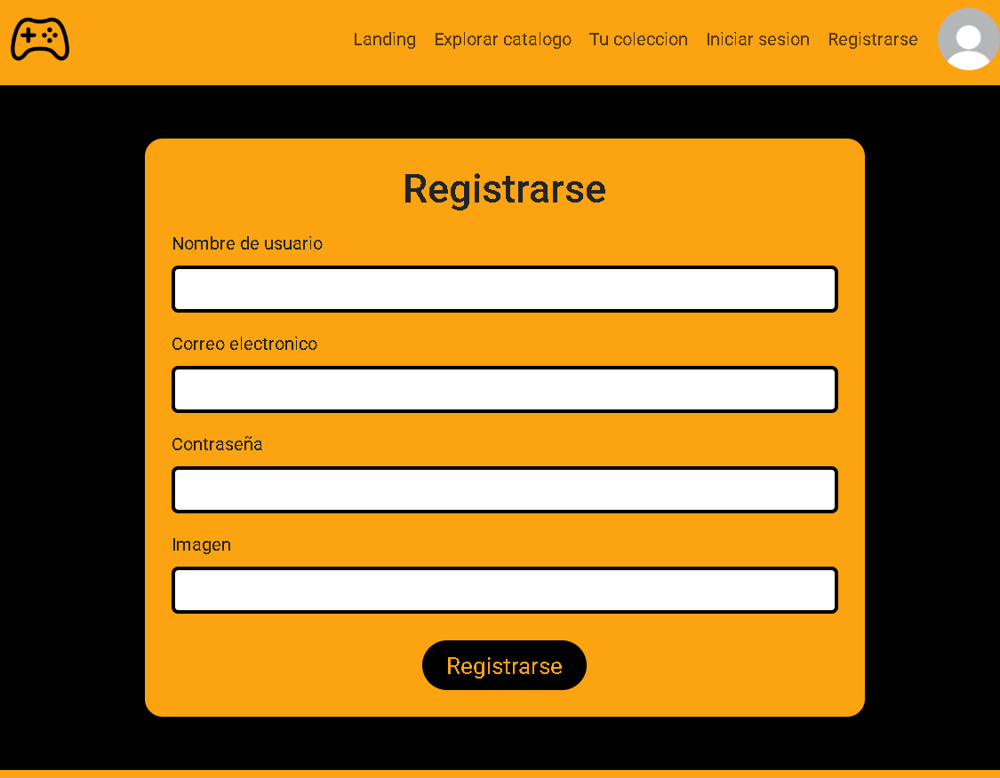

- **Catalogo:** Pagina donde el usuario podra buscar un videojuego por medio de la barra de busqueda o de forma manual.

  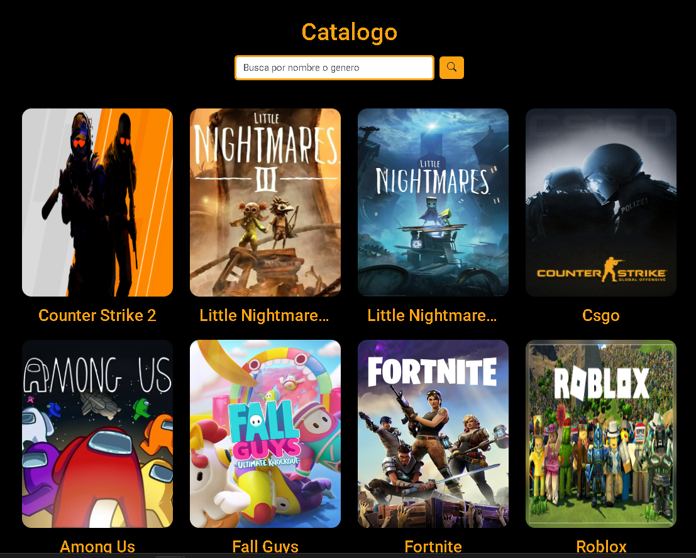

- **Detalles:** Seccion donde el usuario puede ver información detallada del juego seleccionado, y tiene la posibilidad de guardarlo en su colección.

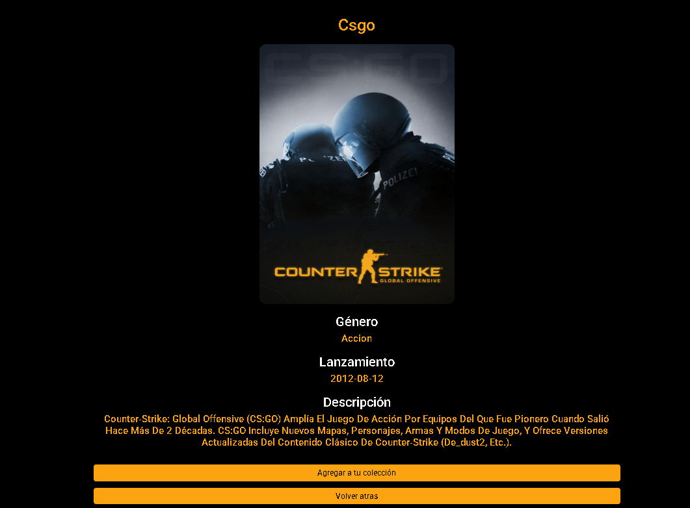

- **Bienvenida:** Seccion donde el usuario puede visualizar su coleccion de videojuegos, buscar en una barra de busqueda en la coleccion, visualizar el estado de los mismos en la coleccion y crear sus propios juegos personalizados.

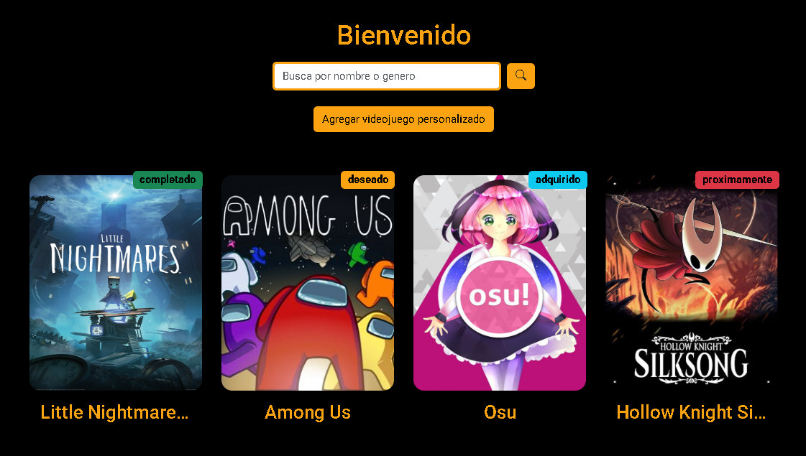

- **Detalle Colección:** Aqui el usuario podra ver informacion de un juego en especifico de su coleccion, pudiendo cambiar su estado, editar su informacion completa y eliminarlo.

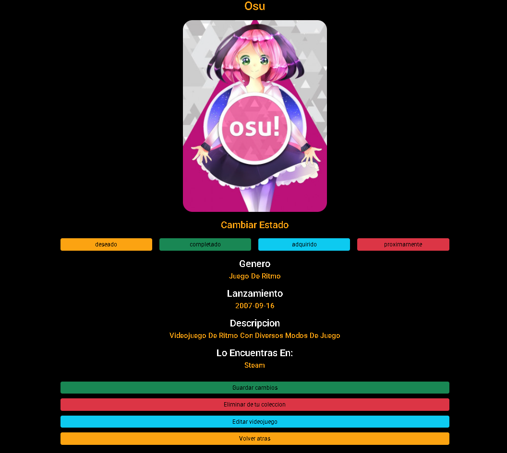

- **Editar videojuego:** Formulario donde el usuario podra editar un videojuego seleccionado por completo.

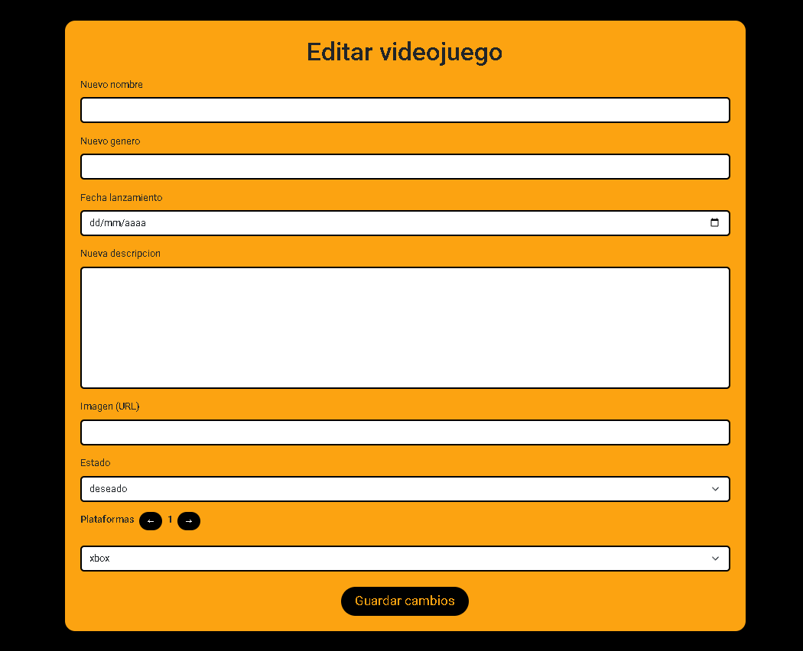

- **Agregar videojuego:** Formulario donde un usuario podra agregar un videojuego personalizado a su coleccion.

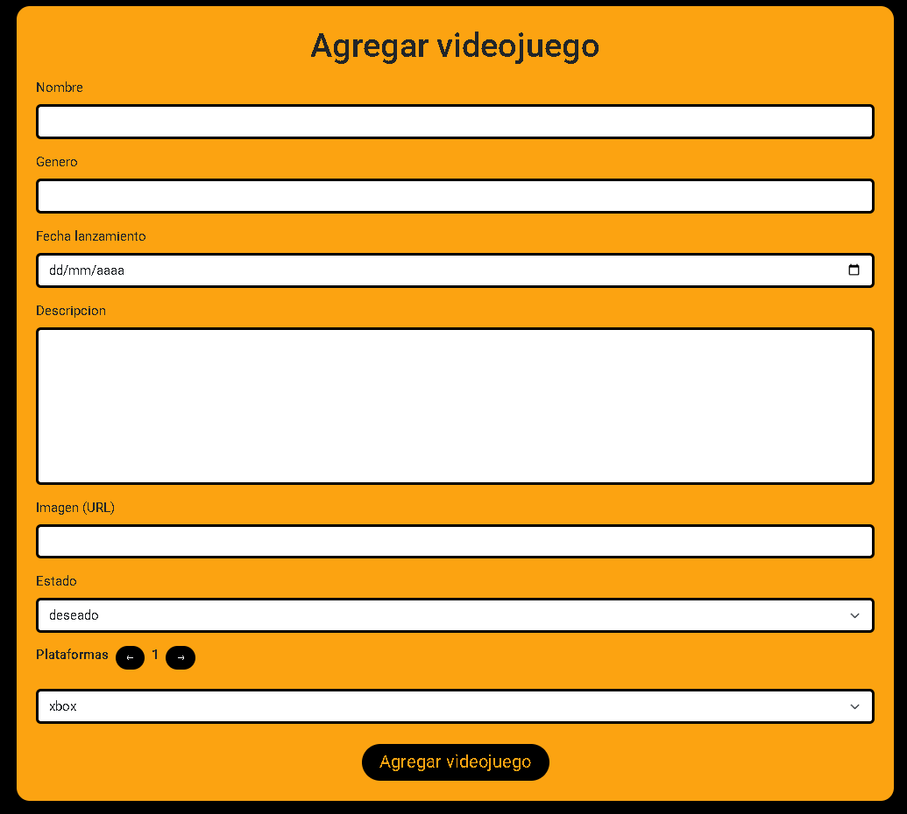 

- **Panel:** Seccion donde el usurio podra visualizar diferentes opciones de interes.

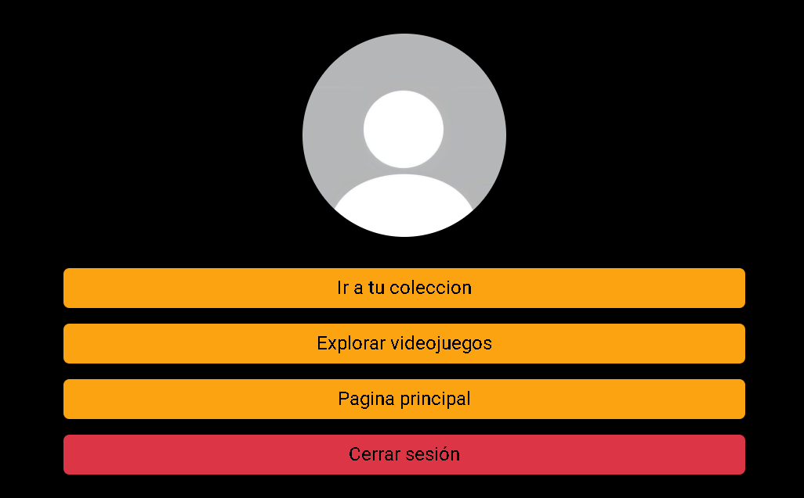 

### Objetivo
Esta aplicación web tiene como objetivo ofrecer una experiencia en donde un usuario pueda explorar un amplio catalogo de videojuegos, crear una cuenta para crear su propia coleccion, gestionar el estado de los juegos en su coleccion, editar sus juegos ingresados e inclusive crear sus propios juegos dentro de la coleccion. La idea es que además de explorar los videojuegos que tiene la aplicacion por defecto para almacenar, los usuarios tengan la posibilidad de editar y agregar los videojuegos que ellos deseen a su coleccion personal.

Algunas de las caracteristicas mas importantes de la aplicacion son:

- El usuario puede agregar videojuegos a su coleccion (personalizados o ya disponibles), editar su coleccion, cambiar el estado de los videojuegos dentro de la coleccion y eliminarlos.

- Los videojuegos de la coleccion del usuario y los que muestra la aplicación web, en la base de datos son diferentes (aunque se agreguen directo desde la aplicación), esto con el fin de que el usuario pueda administrar su coleccion por completo sin que eso afecte a los juegos que se muestran por defecto en la aplicación web.

- Existen rutas protegidas, donde solo usuarios con una cuenta pueden acceder, sobre todo son las secciones para navegar por el catalogo, visualizar colecciones y administrarla. Para acceder a ellas se hace uso del inicio de sesion, y si es necesario tambien del registro (para crear una cuenta nueva).

- El proceso de autenticacion se hace directamente desde la API, toda la validacion de datos y demas se gestiona alli, el front-end solamente recibe si todo salio bien o mal, y el token de sesion para que el usuario pueda acceder a las rutas protegidas.

- Todas las contraseñas de los usuarios se encuentran almacenadas en a base de datos por medio de un hash, que no es reversible y se tiene la capacidad de validar si la contraseña es o no la correcta sin la necesidad de conocer la original.
  
## Tecnologias Utilizadas
A continuacion listare las tecnologias utilizadas en el proyecto y su finalidad:

- **Express:** Fue el framework utilizado para el desarrollo de la API, que fue necesaria para la interaccion entre el front-end y la base de datos MongoDB, igualmente para realizar las validaciones de datos, entrega de tokens y validacion de sesiones.

- **Node:** Entorno de ejecucion del lado del servidor para JavaScript, esta tecnologia fue fundamental para realizar la contruccion de la API, uso de React para el front-end y en si lograr toda la comunicacion con la base de datos y uso de librerias de cifrado para contraseñas y generacion de tokens, que no pueden ser utilizados de manera convencional en el navegador.

- **Typescript:** Es un superset de JavaScript que permite el tipado fuerte de datos, garantizando que mi aplicacion (sobre todo en la API) el uso correcto de tipos de datos, variables, funciones, metodos y demas, se haga de forma correcta, permitiendome crear un codigo seguro y lo mas robusto posible.

- **Argon2:** Es una funcion hash que permite tomar una cadena (string) y cifrarla de tal manera que sea imposible conocer el contenido original, en este proyecto utilice Argon2 para el almacenamiento de contraseñas en la base de datos.

- **JWT:** Es una tecnologia que permite crear tokens que viajan de forma segura por la red, se encarga de cifrar cualquier tipo de informacion por medio de una palabra secreta, en donde gracias a esta ultima es posible validar si al servidor los tokens de sesion son veridicos, alterados y tener la posibilidad de guardar informacion importante en el token, sobre todo para la sesion del usuario.

- **Docker:** Con el fin de que la base de datos MongoDB pudiera correr en cualquier maquina, decidi utilizar Docker, ya que me permitio contenerizar la base de datos y poder usarla sin la necesidad de descargar todo el SGBD, haciendo muchisimo mas ligera y portable la base de datos, que es una parte fundamental de la aplicacion web construida.

- **MongoDB:** Es el sistema gestor de base de datos (SGBD) que utilice para el desarrollo de la apliacion web, sobre todo debido a la informacion no estructurada que maneja la aplicacion web (colecciones de videojuegos, imagenes, etc.) ademas que una de sus ventajas es que la velocidad en operaciones de lecutra es demasiado buena, lo que ademas de almacenar informacion, permite que la recuperacion de informacion sea lo mas eficiente posible.

- **React:** Es una biblioteca para desarrollo web especializada en la construccion de apliaciones web con un enfoque modular y en componentes, esta tecnologia me permitio construir la apliaccion web del catalogo de videojuegos utilizando menos codigo, siendo mas organizado y con la principal ventaja de utilizar componentes y reutilizarlos siempre que lo necesite, logrando cambiar su comportamiento con los props y manteniendo una interactividad y cambio de estados sin la necesidad de recargar la pagina de manera repetida.

- **Vite:** Fue la tecnologia encargada de empaquetar todo el codigo en React (JSX) y convertirlo en recursos estaticos que entiende el navegador (HTML, CSS y JS), ofreciendo que esos archivos compilados esten lo mejor optimizados posible para entornos de produccion en donde la velocidad, CEO y demas aspectos son fundamentales.

- **Swagger:** Es una tecnologia que se compone de varias herramientas de software, que principalmente me ayudaron a documentar de una forma rapida y con un resultado bastante comprensible, la funcionalidad de la API que construi en Express para este proyecto, y que asi utilizarla mas adelante sea muchisimo mas sencillo, ya que todos los endpoints, parametros y codigos de estado Swagger los muestra en la documentacion. Por medio de un archivo yaml y su integracion en Express, en una ruta personalizada se encuentra la documentacion de la API.

- **Bootstrap:** Es un framework CSS que me ayudo demasiado con el estilado de mis componentes construidos en React, en donde gracias a las clases CSS prediseñadas (tarjetas, botones, etc) que vienen con configuraciones responsive por defecto, el proceso de estilado fue notablemente mas rapido dentro de la aplicacion web, igualmente me permitio aplicar mis propios estilos personalizados a esos componentes. Junto Bootstrap Icons, tambien logre integrar iconos dentro de la aplicacion web.

- **Moongose:** Es una libreria del ecosistema de Node que utilice en el backend utilizando Express, que me dio la posibilidad de interactuar con la base de datos MongoDB de una forma bastante sencilla, y realizar todas las operaciones necesarias en cada uno de los endpoints de la API que construi.

# Instrucciones para la Instalacion del Proyecto

Para ejecutar este proyecto sera fundamental tener en cuenta el siguiente paso a paso y recomendaciones.

El primer paso es realizar la clonacion del repositorio de GitHub, ubicandose en una carpeta recien creada o de su eleccion, ejecutar el siguiente comando en la terminal que se tiene que abrir en la ubicacion donde esta la carpeta donde desea clonar el proyecto.

```bash
git clone https://github.com/Erick-Uniminuto/CatalogoVideojuegos
```
>[!caution]
Es necesario contar con [Git](https://git-scm.com/) **instalado** y configurado antes de realizar la ejecucion de este comando en la terminal.

Luego de realizar la clonacion del proyecto, el siguiente paso sera realizar la instalacion de la base de datos, para ello se tendrá que utilizar Docker.

>[!IMPORTANT]
Es importante contar con Docker instalado para la ejecución de este proyecto, [aqui](https://www.docker.com/products/docker-desktop/) el enlace de instalación. Si hay problemas durante la instalación en Windows, importante tener instalado WSL (subsistema de Windows para Linux), [aqui](https://docs.docker.com/desktop/troubleshoot-and-support/troubleshoot/topics/) una documentacion para la solucion de problemas frecuentes con la instalación.

Una vez que se tiene Docker Desktop, realizar la instalación pertinente (en caso de no haberlo hecho) y realizar el siguiente paso a paso.

1. Realizar la creacion de la cuenta o continuar sin crear una, para asi lograr acceder a la aplicación de Docker Desktop.

2. En la barra de busqueda de la parte superior dentro de **Docker Desktop**, se debe buscar la imagen de MongoDB, asi como se muestra en la imagen se debe descargar la imagen oficial (insignia verde), una vez identificada, presionar en el boton **PULL**.

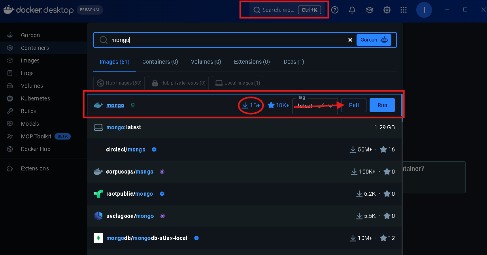

3. Despues de que se complete la descarga, nos debemos dirigir a la barra lateral izquierda y dirigirnos a la seccion que dice **Images** o imagenes, alli se deberia encontrar la imagen de MongoDB, y como se muestra en la imagen se debe presionar donde se indica.

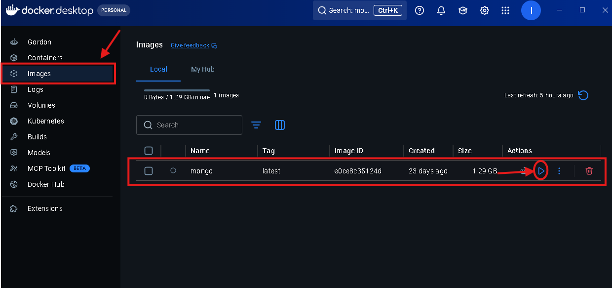

4. Saldra una ventana, en donde se debe presionar en **Optional Settings**, aqui es importante colocar los siguientes parametros de configuracion, el nombre del contenedor puede ser cualquiera, el puerto debe ser el **27017**.

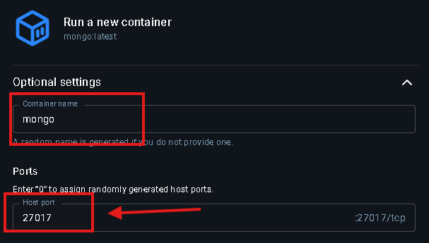

>[!CAUTION]
Si el puerto **27017** se encuentra ocupado, es importante garantizar que el contenedor pueda utilizar este puerto, ya que es el que utiliza el proyecto para que la API se logre comunicar con la base de datos.

5. Este paso es fundamental, y es que la carpeta **Volumenes** del proyecto clonado, contiene toda la informacion para que MongoDB cargue las colecciones y documentos iniciales. Por ello en la parte de **Host Path** al seleccionar los tres puntos se abrira un explorador de archivos, **Obligatoriamente se selecciona la carpeta Volumenes del proyecto**, luego de hacer eso, en la opcion de **Container Path** se debe escribir el siguiente texto; **/data/db**, una vez hecho eso se puede correr el contenedor con el boton **Run**.

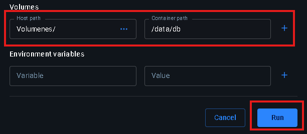

6. Si todos los pasos fueron seguidos correctamente, se deberia ver la siguiente pantalla dentro de **Docker Desktop** que indica que MongoDB en el contenedor ya se encuentra ejecutandose (recuadro blanco y rojo son solo censura).

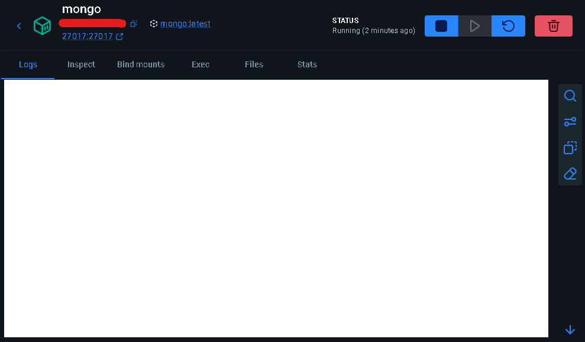

>[!IMPORTANT]
Si la ejecución final del contenedor no salio correctamente, por favor revisar nuevamente el paso a paso expuesto, ya que probablemente se habrá realizado algún paso de forma erronea, **especial atención en la configuracion del puerto y volumen**.


Una vez que se tiene ejecutando Docker con MongoDB, hay que volver a la carpeta en donde se encuentra el proyecto clonado y abrir una terminal alli. 

>[!WARNING]
Es importante que para los siguientes pasos se tenga instalado **Node.js** y el administrador de paquetes **NPM** o el de su preferencia. [Aqui](https://nodejs.org/es/download) dejo enlace para la instalacion de Node (NPM viene por defecto en la instalacion de Node.)

Una vez abierta la terminal se deben ejecutar los siguientes comandos **en el orden que se presentan aquí.**, es importante garantizar que donde se abre la terminal, se encuentre el archivo **package.json**, de lo contrario no funcionara el comando o realizara alguna accion no deseada.

```bash
npm install
# Comando para realizar la instalación de 
# todas las dependencias necesarias para ejecutar el  proyecto
```

Una vez que se instalen todas las dependencias, lo siguiente a ejecutar en la misma terminal será:

```bash
npm run front
```

Este comando lo que hará, será arrancar el fontend de la aplicación web, por ende ahora al entrar a la siguiente URL:

```
http://localhost:5173
```

Se podra visualizar la aplicación web, es importante tener en cuenta que esa terminal debe permanecer abierta para que la aplicación pueda seguir siendo visible.

>[!TIP]
Es importante tener en cuenta que cuando el front-end se inicia, **Vite** nos dira el puerto donde se encontrara corriendo la aplicación web, por defecto es el **5173** pero puede cambiar.

Luego de ello antes de probar la aplicación web, es fundamental tener en cuenta que no funcionara correctamente, ya que el back-end sigue apagado, con el siguiente comando se iniciara:

>[!NOTE]
El siguiente comando se debe ejecutar en una terminal diferente a donde se inicio el front-end, pero manteniendo la ubicacion en la carpeta del proyecto donde se encuentra el archivo **package.json**.

```bash
npm run dev
```

Una vez se ejecute ese comando, el backend estara iniciado, y ahora si, se podra interactuar con la aplicacion web de forma completa, creando videojuegos, editando y creando usuarios, ya que la base de datos funcionara y estara guardando los datos y manteniendo la persistencia.

>[!IMPORTANT]
Cuando se cierre el proyecto, si el contendor en **Docker Desktop** se elimina, se perdera toda la información creada, pero siempre y cuando al crear el contenedor se utiliza la carpeta **Volumenes** del proyecto, toda la informacion se mantendrá guardada y persistente.

>[!TIP]
Una vez que el back-end este en funcionamiento, se estara utilizando el puerto 3000, es importante no cambiarlo. Si se desea conocer como funciona la API, en el enlace **http://localhost:3000/docs** se encuentra toda la documentacion de la API hecha con Swagger, servida por el archivo **api_docs.yaml**